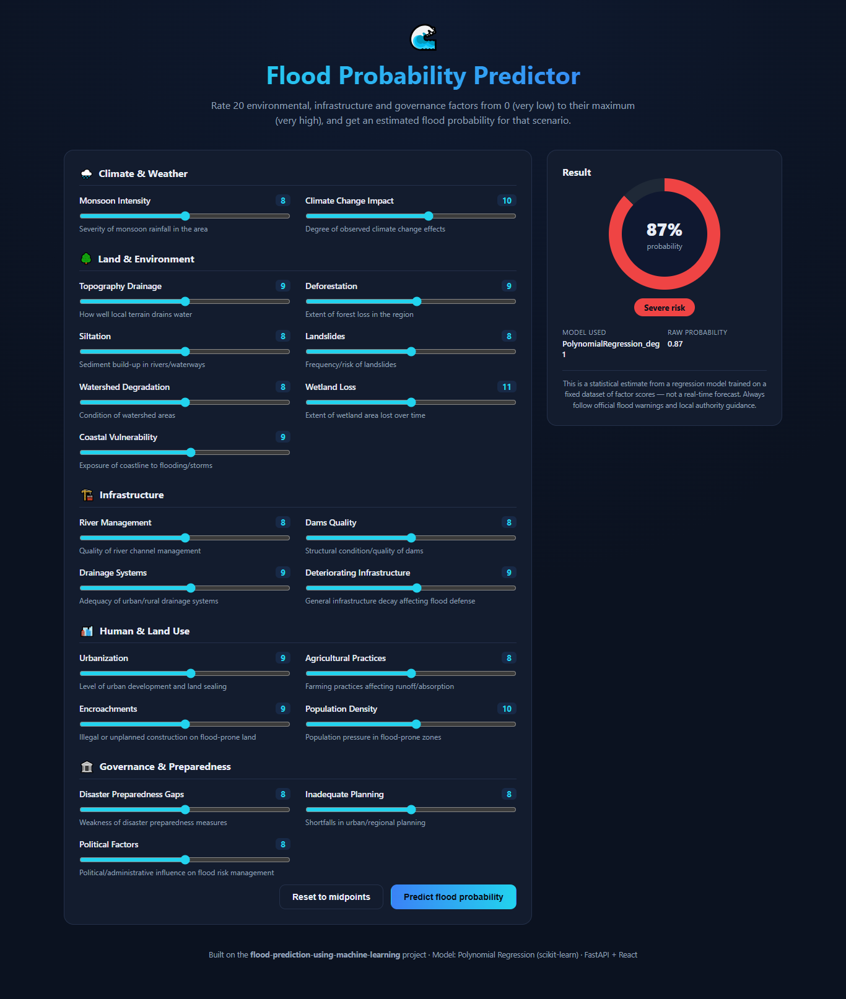

<div align="center">

# 🌊 Flood Probability Predictor

### An end-to-end Machine Learning web application that predicts flood probability from 20 environmental, infrastructure, and governance risk factors.

📚 **University Semester Project** — extends the original ML research/notebook work into a fully deployed, user-facing product.

[](https://flood-prediction-app-oyar.onrender.com/)
[](https://www.python.org/)
[](https://fastapi.tiangolo.com/)
[](https://react.dev/)
[](https://www.typescriptlang.org/)
[](https://scikit-learn.org/)
[](https://www.docker.com/)
[](LICENSE)

</div>

---

## 📖 About This Project

This project began as an academic machine learning assignment — **[flood-prediction-using-machine-learning](https://github.com/devawais01/flood-prediction-using-machine-learning)** — where I performed exploratory data analysis, preprocessing, feature engineering, and trained/compared **Polynomial Regression** and **K-Nearest Neighbors Regression** models to estimate flood probability from 20 environmental and geographical indicators.

For this semester's project deliverable, I took that research notebook and **turned it into a complete, deployed, end-user application**: a REST API that serves the trained model, and an interactive web interface where anyone can enter risk-factor scores and instantly see a predicted flood probability — no coding or notebooks required.

> 🔗 **Try it live:** **https://flood-prediction-app-oyar.onrender.com/**
> *(Hosted on Render's free tier — the app may take ~30 seconds to wake up if it has been idle.)*

---

## 🖼️ Screenshot

<div align="center">
  
</div>

---

## ✨ Features

- 🎚️ **20 grouped, labeled sliders** — factors organized into 5 intuitive categories (Climate & Weather, Land & Environment, Infrastructure, Human & Land Use, Governance & Preparedness) instead of one long, confusing form
- 🌡️ **Live risk gauge** — animated circular meter showing predicted probability as a percentage
- 🏷️ **Color-coded risk levels** — Low / Moderate / High / Severe, so results are instantly readable, not just a raw number
- ⚡ **Instant predictions** — sub-second response from the API
- 📱 **Fully responsive** — usable on desktop, tablet, and mobile
- 🔌 **Self-describing API** — the frontend fetches valid input ranges from the backend at load time, so the UI never goes stale relative to the model
- 🐳 **One-command deploy** — a single Docker image bundles the trained model, the API, and the built frontend

---

## 🧠 Machine Learning Details

| Aspect | Detail |
|---|---|
| **Dataset** | 50,000 records × 20 environmental/geographical features, target: `FloodProbability` (continuous, 0–1) |
| **Preprocessing** | `StandardScaler` feature scaling, 80/20 train-test split, `random_state=42` |
| **Models compared** | Polynomial Regression (degrees 1–3) vs. K-Nearest Neighbors Regression (k=5) |
| **Model selection** | Automatic — best test-set R² wins |
| **Winning model** | Polynomial Regression, degree 1 (i.e. Linear Regression) |
| **Performance** | **R² ≈ 1.00**, MAE ≈ 0.00 — this dataset's flood probability is (by construction) an almost perfectly linear function of the 20 factor scores, so the simplest model wins honestly, beating KNN (R² ≈ 0.77) |

The training script (`backend/train_model.py`) prints the full comparison table for all candidate models every time it runs, so the model-selection process is fully transparent and reproducible.

---

## 🏗️ System Architecture

```
┌───────────────────────────┐        POST /api/predict          ┌────────────────────────────┐
│   React + TypeScript UI   │ ────────────────────────────────▶ │      FastAPI Backend        │
│   (Vite build)             │                                     │                              │
│  • 20 grouped sliders      │ ◀──────────────────────────────── │  • Pydantic input validation │
│  • Live risk gauge         │     JSON: probability, risk         │  • StandardScaler.transform  │
│  • GET /api/meta on load   │     label, model used               │  • model.predict()           │
└───────────────────────────┘                                     │  • Risk-level bucketing      │
                                                                     └──────────────┬───────────────┘
                                                                                    │ loaded at startup
                                                                                    ▼
                                                                     model/model.pkl   (trained
                                                                     model/scaler.pkl   Polynomial
                                                                     model/meta.json    Regression,
                                                                                        degree 1)
```

Both the frontend and backend ship inside **one Docker container** — FastAPI serves the compiled React app as static files *and* answers API requests from the same process, which is what makes single-service free hosting (Render) possible.

---

## 🛠️ Tech Stack

| Layer | Technology |
|---|---|
| **Frontend** | React 18, TypeScript, Vite |
| **Backend** | FastAPI, Pydantic, Uvicorn |
| **Machine Learning** | scikit-learn, pandas, NumPy |
| **Containerization** | Docker (multi-stage build) |
| **Hosting** | Render (free tier, Docker web service) |

---

## 📁 Project Structure

```
flood-app/
├── Dockerfile                # multi-stage: builds React, then runs FastAPI serving both UI + API
├── README.md
├── backend/
│   ├── main.py                 # FastAPI app — /api/meta, /api/predict, /api/health
│   ├── train_model.py          # offline training script → model/*.pkl
│   ├── requirements.txt
│   ├── dataset/flood.csv       # original training dataset
│   └── model/
│       ├── model.pkl             # trained regression model
│       ├── scaler.pkl            # fitted StandardScaler
│       └── meta.json             # feature names, ranges, and metrics
└── frontend/
    ├── src/
    │   ├── App.tsx                # main UI: form + result panel
    │   ├── App.css
    │   ├── api.ts                 # typed API client
    │   └── featureConfig.ts       # labels/descriptions/grouping for all 20 inputs
    └── public/favicon.svg
```

---

## 🚀 Getting Started Locally

### Run with Docker (recommended)

```bash
git clone https://github.com/devawais01/flood-prediction-app.git
cd flood-prediction-app
docker build -t flood-app .
docker run -p 7860:7860 flood-app
```

Visit **http://localhost:7860**.

### Run frontend and backend separately (development mode)

```bash
# Terminal 1 — backend
cd backend
python3 -m venv .venv && source .venv/bin/activate
pip install -r requirements.txt
uvicorn main:app --reload --port 8000

# Terminal 2 — frontend
cd frontend
npm install
npm run dev
```

Visit **http://localhost:5173** (Vite proxies API calls to the backend automatically).

### Retrain the model

```bash
cd backend
python3 train_model.py
```

---

## ☁️ Deployment

This app is deployed on **[Render](https://render.com)** as a free Docker web service, connected directly to this GitHub repository — every push to `main` triggers an automatic redeploy.

To deploy your own copy:
1. Fork/push this repo to your GitHub.
2. On Render: **New → Web Service → connect this repo → Instance Type: Free → Create Web Service**.
3. Render detects the `Dockerfile` automatically and builds/deploys it.

---

## 📡 API Reference

| Endpoint | Method | Description |
|---|---|---|
| `/api/health` | `GET` | Liveness check |
| `/api/meta` | `GET` | Feature names, valid ranges, and model metrics |
| `/api/predict` | `POST` | Takes `{"features": {...20 keys...}}`, returns predicted probability + risk level |

**Example request:**
```json
POST /api/predict
{
  "features": {
    "MonsoonIntensity": 8, "TopographyDrainage": 9, "RiverManagement": 8,
    "Deforestation": 9, "Urbanization": 9, "ClimateChange": 10,
    "DamsQuality": 8, "Siltation": 8, "AgriculturalPractices": 8,
    "Encroachments": 9, "IneffectiveDisasterPreparedness": 8,
    "DrainageSystems": 9, "CoastalVulnerability": 9, "Landslides": 8,
    "Watersheds": 8, "DeterioratingInfrastructure": 9,
    "PopulationScore": 10, "WetlandLoss": 11, "InadequatePlanning": 8,
    "PoliticalFactors": 8
  }
}
```

**Example response:**
```json
{
  "flood_probability": 0.87,
  "flood_probability_pct": 87.0,
  "risk": { "label": "Severe", "color": "#ef4444" },
  "model_used": "PolynomialRegression_deg1"
}
```

---

## ⚠️ Limitations & Disclaimer

This tool estimates flood probability from a fixed set of *hypothetical* factor scores based on a historical training dataset — it does **not** use live weather, satellite, or hydrological data, and is **not** a real-time flood forecasting or early-warning system. It was built for academic and demonstrative purposes. For actual flood risk information, always consult official meteorological and disaster-management authorities.

---

## 🌱 Future Enhancements

- [ ] Integrate live weather/hydrological data APIs for real-time predictions
- [ ] Add historical prediction logging and analytics dashboard
- [ ] Support batch predictions via CSV upload
- [ ] Add authentication for saved user scenarios
- [ ] Explore ensemble/deep learning models for comparison

---

## 👨‍💻 Author

**Muhammad Awais**
Developed as a semester project, building on earlier coursework in machine learning.

🔗 GitHub: [github.com/devawais01](https://github.com/devawais01)
💼 LinkedIn: [linkedin.com/in/dev-awais01](https://www.linkedin.com/in/dev-awais01)

---

## 📄 License

This project is licensed under the **MIT License**. See [LICENSE](LICENSE) for details.

<div align="center">

⭐ If you found this project useful, consider giving it a star!

</div>
